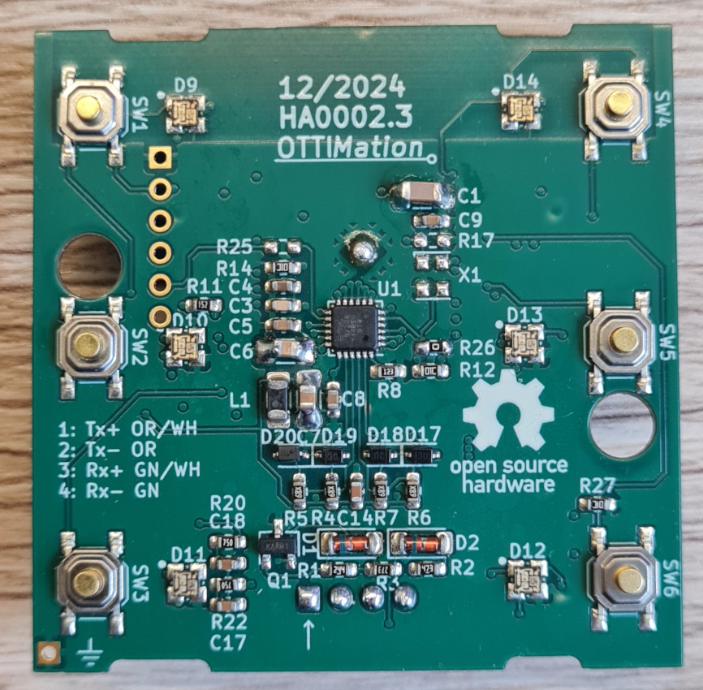

<table width="100%">
<tr>
<td><H1>EthSwitch</H1></td>
<td align="right"></td>
</tr>
</table>

## Hardware features
- 6 Buttons
- 6 RGB LEDs
- 100 MBit wired Ethernet
- Supplied by any POE capable switch or POE injector
- Same dimensions as Jung Push-button module
- Temperature sensor

## Firmware features
- Sends button state via MQTT
- Receives LED states via MQTT
- Over the air update (OTA)
- Debugging via Telnet
- Configuration (Name, MQTT broker, MQTT Topics, ...) via Website
- Smal website to check the current state of the butons and LEDs
- Transmit button state and read LED from Beckhoff PLC via ADS (experimental)

## Motivation

 
Original Jung A 5248 TSM  

This is a very nice piece of hardware. But it comes with three downsides.  
1. For this switch you need 8 wires for the buttons and one common wire. The LEDs also need 8 wires and a common GND. So at least 18 wires have to be routed to your control cabinet. This quickly adds up. Imagine a house with 10 switches where you have to handle 180 wires.  
2. Usually these wires are connected to your smart home controller or PLC. On this side you also need 8 inputs and 8 outputs for every single switch, which are not cheap and take a lot of space.
Further more the LEDs are implemented in positive logic with a nominal voltage of 24 V. So your controller needs outputs with high side switches which are very common but are also more expensive than low side switches.
3. This switch is not cheap. This 8 channel version with white buttons has a recommended retail price incl. VAT of 165.35 €! Additionally you need the in-/output hardware on the controller side.

## Solution
I created a PCB which has exactly the same outline like the original PCB used in the Jung switch. The position of the switches, the LEDs and the mounting holes are also identical. Also the 3D printed case has the same dimensions.  
After being installed, all visible parts are the original buttons and the transparent cover purchased from Jung. So this device is visually indistinguishable from the original.  

The main components on the PCB are:
- POE logic
- POE to 3.3V power supply
- LAN8720 Ethernet Phy
- ESP32
- 6 Switches
- 6 WS2812 RGB LEDs
- MCP9700 temperature sensor (not implemented yet)

## Jung part numbers

<table>
<tr>
    <th>Article Number</th>
    <th>Description</th>
    <th>Recommended retail price without VAT (2025)</th>
</tr>
<tr>
    <td>A 503 TSA WW</td>
    <td>Cover kit 3-gang, F50, AS/A range, white Tastensatz 3fach, F50, Serie AS/A, alpinweiß</td>
    <td>9,19 € </td>
</tr>
<tr>
    <td>A 50 NA</td>
    <td>Transparent cover with paper inlay 1-gang, F50, A range, transparent 
    Transparente Abdeckung mit Einlage 1fach, F50, Serie A, transparent</td>
    <td>5,73 €</td>
</tr>
<tr>
    <td>5000004100</td>
    <td>Supporting metal frame for mounting 
    Tragring</td>
    <td>?</td>
</tr>
<tr>
    <td>A 5236 TSM</td>
    <td><b>Just for reference. Not nedded for this project</b> 
    Push-button module 24 V AC/DC, 20 mA, 3-channel, 6 contacts, AS/A range 
    Tastsensor-Modul 24 V AC/DC, 20 mA, 3-kanalig, 6 Schaltpunkte, Serie AS/A
     </td>
    <td>106,15 €</td>
</tr>
</table>

## PCB

 

 
Made with KiCad

## Mecanical Parts

The front is printed with transparent resin. So the case also serves as prism for the LEDs

## Real images

   

## Current state / possible improvements
Everything is working fine :-)
- Add WiFi. Currently only wired Ethernet is supported
- Add Home Assistant binary sensor
- Everything is hand soldered. So the BOM is not optimized for production at one of the large PCB manufacturers
- Perhaps complete new design based on the Jung LS series. The currently used A series is very smal and needs an adapter frame to fit into my installation.

If there is interest in this project, I can also upload the KiCad project and the step files.

